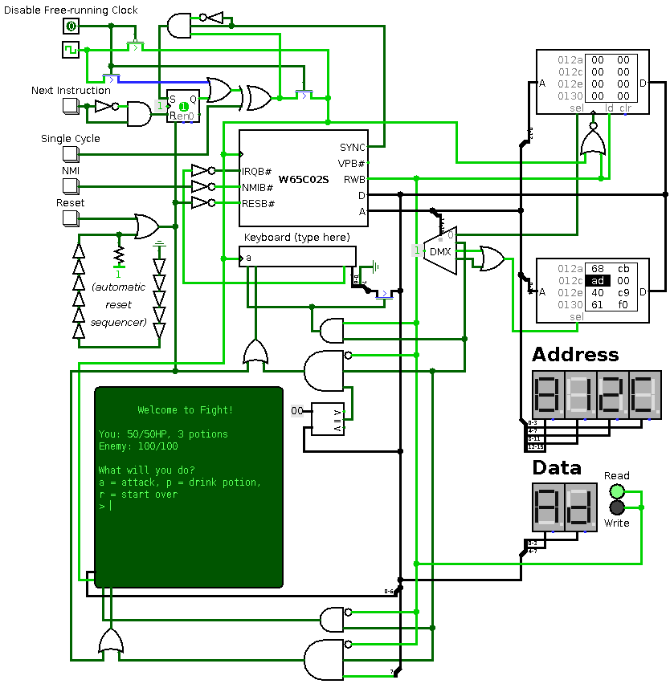
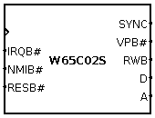
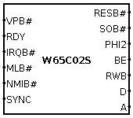
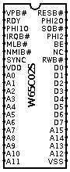

This is a component library for Dr. Carl Burch's excellent program [Logisim](http://www.cburch.com/logisim/). It includes three different variations on the W65C02S, Western Design Center's flagship 8-bit CPU/microcontroller. This chip is descended from (and largely compatible with) the venerable [6502](https://en.wikipedia.org/wiki/MOS_Technology_6502), the low-cost CPU that powered the home computer revolution.

With this component library, you can design circuits that are intended to interface with a bare W65C02S. You can also use it to design and explore low-level computer architectures that would not have been out of place in the 70's and 80's.

It is *fairly* accurate, but:

- Interrupt timing is a few cycles off
- There are inaccuracies in rarely-used operations (such as decimal math)

In addition:

> A real 65xx latches data and changes bus status on the falling edge of the clock. The one simulated here latches data on the falling edge (correct) but changes bus status on the rising edge (incorrect).  
> (issue #1)

Thanks to [65test](https://github.com/SolraBizna/65test), I have fully reverse engineered the black box behavior of the W65C02S, but I haven't had time to update this emulator with what I found.

# Usage

Download `logi6502.jar` (perhaps from the [releases page](https://github.com/SolraBizna/logi6502/releases)) and put it somewhere. Open Logisim. With a project opened, go to Project → Load Library → JAR Library, and select `logi6502.jar`. There should now be a new category of tools called "W65C02S". Inside it are three different versions of the W65C02S.

The demo circuit shown on top of the page is in `demo.circ`. Open it, make sure Simulate → Ticks Enabled is checked, and set Simulate → Tick Frequency to some high value. See [Demo Circuit](#demo-circuit) for more information.

## Versions

### Simple

This is the simplest variant, with almost the minimum number of pins to make use of this CPU. In addition, all inputs are on the left and all outputs are on the right.

### Expert

This is a more complex variant, exposing every feature of the CPU. The pins are in *roughly* the same permutation as they are on a PDIP-40 W65C02S; the A and D pins have been grouped together, power and extra clock pins have been removed, and the NC pin is removed.

### PDIP-40

This is the "realistic" version, exposing every pin in the same manner and the same position as a real PDIP-40 W65C02S. If you use this version, you must connect VDD to a logic 1 and VSS to a logic 0, just like how you must supply +5V to the VDD and 0V to the VSS of the real part.

## Pins

Pins ending in # are active-low. Not every version has every pin. See the W65C02S datasheet for WDC's definitions and detailed descriptions of each pin. Here's a quick summary:

- **A**: Output. The address that the CPU is reading/writing from/to this cycle.
- **BE**: Input. Drive it low to leave the bus pins (A, D, RWB) floating, drive it high to enable them. Driving this low does not, on its own, stop the CPU from executing! If you use this, you may want to use RDY as well!
- **D**: Bidirectional. If RWB is high, the CPU will expect to read the data on these pins when the clock falls. If it is low, the CPU will expect that the data on these pins will be written to memory when the clock falls.
- **IRQB#**: Input. Drive it low to signal an Interrupt Request. Should be pulled high on the real chip.
- **MLB#**: Output. Memory lock. Driven low when performing a read-modify-write instruction, high otherwise. Useful in multiple-processor / DMA situations.
- **NC**: Do not connect this pin on a real W65C02S. In the simulated one, it does nothing.
- **NMIB#**: Input. Drive it low to signal a Non Maskable Interrupt. Unlike IRQB#, this is an *edge*-triggered signal, not a *level*-triggered one.
- **PHI2**: Input. The CPU clock. See [Clock](#clock).
- **PHI1O**: Output. The CPU will set this to the negation of PHI2. WDC recommends that you never use this.
- **PHI2O**: Output. The CPU will set this to PHI2. WDC recommends that you never use this.
- **RESB#**: Input. Drive it low to signal a reset, and then drive it high for normal operation. The real chip requires this to be low for at least two PHI2 cycles, but the simulated one is fully reset by even a brief pulse.
- **RDY**: Bidirectional. Pull this pin high. Drive it low if you want to pause the CPU. The CPU will drive it low during execution of a `WAI`. (In Logisim, you can simulate this by putting a gate in front of the clock port, but reality is more complex.)
- **RWB**: Output. Driven high if the current bus cycle is a read, low if it is a write.
- **SOB#**: Input. Drive low to asynchronously set the V bit in the CPU's status register. WDC recommends that you never use this.
- **SYNC**: Output. Driven high when fetching an *instruction opcode*, low otherwise. Useful for stepping with instruction-level granularity, or for strange No-Execute hardware.
- **VPB#**: Output. Driven high when operating as usual. Driven low when fetching an interrupt vector.

To reduce unnecessary logic, the following inputs act as if pulled high when left floating or omitted from a variant: BE, IRQB#, NMIB#, PHI2, SOB#.

## Clock

The W65C02S updates its outputs after the *rising* edge of the clock. When reading, it reads D on the *falling* edge of the clock. When writing, it expects the values it has exposed on D to be written at the *falling* edge of the clock.

Most Logisim parts can be configured to update on the falling edge. However, the RAM part cannot; it is only triggered on the "rising edge", no matter what. The incoming clock signal must be inverted. Fortunately, the "ld" pin has the same meaning as the W65C02S's RWB pin, you can hook it up directly.

## Demo Circuit

This is `demo.circ`, whose picture is at the top of this page. This is a simple computer using the Simple variant of the W65C02S. It has 32KiB of ROM, 16KiB of RAM, and simple ASCII input and output. It comes with an extremely simple RPG-style combat game preloaded into ROM. (The source code to this game, and a script to compile and convert it, is in `fight/` in the repository.)

To use the keyboard, you must click it with the Poke tool. The keyboard's "available" output is hooked up to the IRQB# pin; thus, it requests an IRQ when there is unread input available.

### Memory Map

- `$0000-$3FFF`: RAM
- `$4000-$7FFF`: IO
- `$8000-$FFFF`: ROM

### IO

Reading or writing any byte in the `$4000-$7FFF` region is an IO read. The low 14 bits of the address are **ignored**

- Reading returns the next character of keyboard input if there is one, and zero otherwise.
- Writing `$00` clears any buffered keys.
- Writing any value with the high bit set (`$80-$FF`) clears the screen and moves the cursor to the upper-left.
- Writing any other value writes that character to the screen. Write 10 to start a new line.

### CPU Control Buttons

- **Disable Free-Running Clock**: 0 means the clock runs normally. 1 means the clock is controlled by the next two buttons.
- **Next Instruction**: When pressed, causes the CPU to run normally until the next time it wants to fetch an instruction.
- **Single Cycle**: Controls the CPU clock directly.
- **NMI**: Signals an NMI when pressed.
- **Reset**: Resets the CPU and all support hardware when pressed.

# Copying

Copyright (c) 2017, Solra Bizna.

Logi6502 is free software; you can redistribute it and/or modify it under the terms of the [GNU General Public License](LICENSE.md) as published by the Free Software Foundation; either version 2 of the License, or (at your option) any later version.

Logi6502 is distributed in the hope that it will be useful, but WITHOUT ANY WARRANTY; without even the implied warranty of MERCHANTABILITY or FITNESS FOR A PARTICULAR PURPOSE. See the GNU General Public License for more details.
